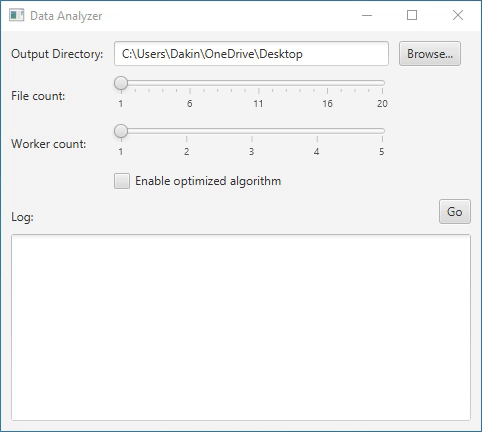

# JavaConcurrent
Demonstrates Concurrency With Java

---

The assignment was to build off from project 3 by using an ExecutorService that does all the thread management by implementing an ExecutorDataProcessor and to implement a new DataRetriever interface but to get the data files from an internet source. It should retrieve a Future should not freeze the GUI.
